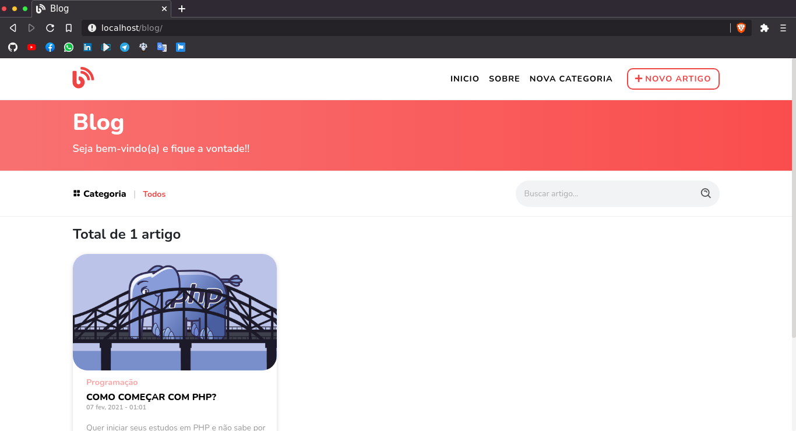
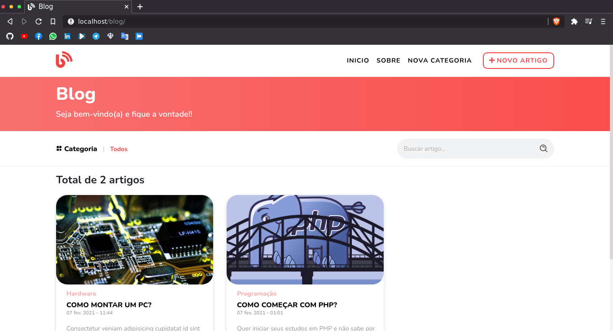
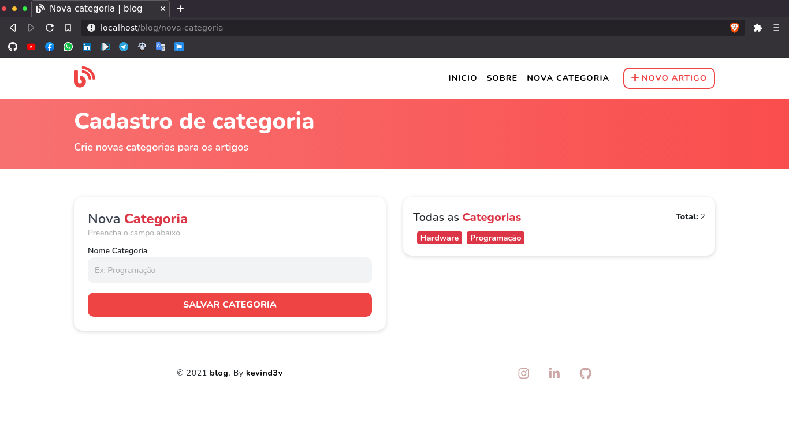

<p align="center">
  <a href="https://unform.dev">
    
  </a>
</p>

<p align="center">Blog desenvolvido em PHP 🐘 puro na estrutura MVC</p>

<h4 align="center"> 
	🚧  Blog 🐘 Em construção...  🚧
</h4>

<p align="center">

<a href="https://github.com/kevind3v">

</a>


<a href="https://github.com/kevind3v/blog/commits/main">
    
  </a>
</p>

### 💻 Sobre o projeto

🐘 Blog - é um projeto desenvolvido em PHP (MVC), tem como objetivo cadastrar artigos de forma simples e muito intuitiva.

### 🎨 Layout

Alguns prints do projeto:





### 🎲 Iniciar Projeto

```bash
# Instalar dependências composer
$ composer install

# Instalar as dependências package.json
$ yarn install
```

### 🛠 Tecnologias

As seguintes ferramentas foram usadas na construção do projeto:

- [Expo](https://expo.io/)
- [Node.js](https://nodejs.org/en/)
- [React](https://pt-br.reactjs.org/)
- [React Native](https://reactnative.dev/)
- [TypeScript](https://www.typescriptlang.org/)

### ⭐️ Autor

<p align="center">
<a href="https://github.com/kevind3v/">
 
 <br />
 <sub><b>Kevin Siqueira <br/> 🐘</b></sub>
</a>
 
</p>

[](mailto:kevinsiqueira.dev@gmail.com)
[](https://www.linkedin.com/in/kevinssiqueira/)
[](https://www.instagram.com/kevind3v/)<br>
