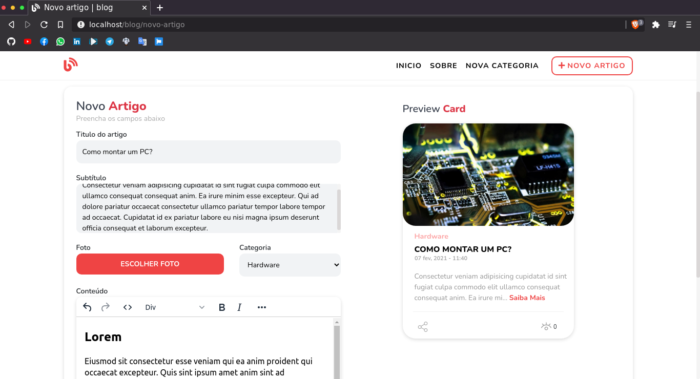

<p align="center">
  <a href="https://unform.dev">
    
  </a>
</p>

<p align="center">Blog desenvolvido em PHP 🐘 puro na estrutura MVC</p>

<h4 align="center"> 
	🚧  Blog 🐘 Em construção...  🚧
</h4>

<p align="center">

<a href="https://github.com/kevind3v">

</a>


<a href="https://github.com/kevind3v/blog/commits/main">
    
  </a>
</p>

### 💻 Sobre o projeto

🐘 Blog - é um projeto desenvolvido em PHP (MVC), tem como objetivo cadastrar artigos de forma simples e muito intuitiva.

### 🎨 Layout

Alguns prints do layout:




### 🎲 Iniciar Projeto

```bash
# Instalar dependências composer
$ composer install

# Instalar as dependências package.json
$ yarn install
```

### Autor

**Kevin Siqueira 👋🏽**

- Github: [kevind3v](https://www.linkedin.com/in/kevinssiqueira/)

- Linkedin: [Entre em contato!](https://www.linkedin.com/in/kevinssiqueira/)
